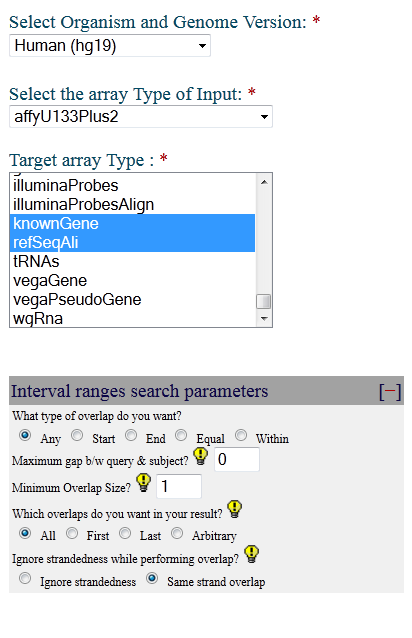
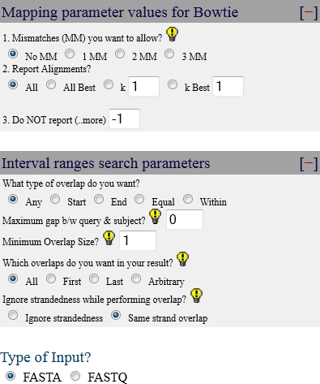

```{r knitrSetup, echo=FALSE}
# sets output for inline results nicely
#knit_hooks$set(inline = identity) 

# kills knitr if there is an error, therefore we don't waste time generating error messages
knit_hooks$set(error = function(x, options) stop(x)) 
```

```{r rsetup, echo=FALSE, warning=FALSE}
# these are extremely useful options for working in R
options(save.defaults=list(compress="xz"), stringsAsFactors=FALSE)
require(affy)
require(arrayQualityMetrics)
require(limma)
require(genefilter)
require(rgr)
require(Biostrings)
```

```{r functionDefs, echo=FALSE}
# this is where I define any custom functions that I want to use

### findMultiple: determine if there are multiple annotations to a probe id. Particularly relevant for the Affy annotations
findSingle <- function(inData, sepStr){
	splitup <- strsplit(inData, sepStr, fixed=TRUE)
	nMult <- sapply(splitup, length)
	return(nMult == 1) # this actually returns false if it is empty as well. useful side effect
}

### calcAverage: using a two column data frame for mapping, and a matrix of values to 
# calculate averages
calcAverageGene <- function(map2map, fromCol, toCol, inVals){
	allto <- unique(map2map[,toCol])
	hasTo <- nchar(allto) != 0
	allto <- allto[hasTo]
	allto <- na.omit(allto)
	outVals <- matrix(0, length(allto), ncol(inVals)) # set up output
	rownames(outVals) <- allto
	colnames(outVals) <- colnames(inVals)
	
	invisible(sapply(allto, function(x){
		useName <- map2map[map2map[,toCol] %in% x, fromCol]
		outVals[x,] <<- apply(inVals[useName, , drop=F], 2, mean) # get average for each array
	}))
	return(outVals)
}

### procAvgDat: after getting the per gene averages, process the data and generate all the statistics for each sample
# assumes rownames are the same
procAvgDat <- function(affyDat, affySamp, agilDat, agilSamp){
	affyDat <- affyDat[rownames(affyDat) %in% rownames(agilDat),]
	agilDat <- agilDat[rownames(agilDat) %in% rownames(affyDat),]

	affyDat <- affyDat[order(rownames(affyDat)),]
	agilDat <- agilDat[order(rownames(agilDat)),]

	if (!all.equal(rownames(affyDat), rownames(agilDat))){
		stop("Row names are not the same!")
	}
	affy.A <- apply(affyDat[, affySamp == "A"], 1, mean)
	affy.B <- apply(affyDat[, affySamp == "B"], 1, mean)

	agil.A <- apply(agilDat[, agilSamp == "A"], 1, mean)
	agil.B <- apply(agilDat[, agilSamp == "B"], 1, mean)

	rma.A <- gx.rma(affy.A, agil.A, log=FALSE, x1lab="affy A", x2lab="agilent A")

	projA <- affy.A * rma.A$a1 + rma.A$a0
	distA <- sqrt((affy.A - projA)^2 + (agil.A - projA)^2)
	corA <- cor(affy.A, agil.A, method="spearman")

	rma.B <- gx.rma(affy.B, agil.B, log=FALSE, x1lab="affy B", x2lab="agilent B")
	projB <- affy.B * rma.B$a1 + rma.B$a0
	distB <- sqrt((affy.B - projB)^2 + (agil.B - projB)^2)
	corB <- cor(affy.B, agil.B, method="spearman")
	sdA <- sd(distA)
	sdB <- sd(distB)
	return(list(A=list(affy=affy.A, agil=agil.A, reg=rma.A, proj=projA, dist=distA, sd=sdA, sCor=corA),
							B=list(affy=affy.B, agil=agil.B, reg=rma.B, proj=projB, dist=distB, sd=sdB, sCor=corB)))
}
```

# MAQC AbsIDConvert

## Authors

Robert M Flight <robert.flight@louisville.edu>, Fahim Mohammad, Eric C Rouchka <eric.rouchka@louisville.edu>

## Abstract

Background:
Current transcriptomics analyses are hampered by an inability to easily convert between various types of identifiers,
making it difficult to easily compare the results of studies performed using different types of platforms. AbsIDConvert,
a tool recently developed by the Rouchka group, makes interconversion of identifiers possible by mapping each type of
identifier to a genomic interval, and using overlapping intervals as the basis for the conversion. Using the MicroArray
Quality Control (MAQC) dataset as an example, this work will demonstrate how the agreement between different experiments 
changes depending on how the platform specific identifiers are converted to allow comparison.

Methodology:
Three types of conversions will be utilized to enable comparison of the data:
 1 - Manufacterer supplied probe annotations to Entrez Gene and Refseq Transcripts
 * - AbsIDConvert based conversion to Entrez Gene and Refseq Transcripts
 * - Direct overlap of the defined genomic intervals for each probe.
For each conversion, the correlation of the signal intensities for matching probes will be investigated, as well as the
rank of probes (using log fold change and p-value) after testing for differential expression between two conditions.

Results: 
AbsIDConvert was used to compare the intensities and ranks of probes measured in the MAQC dataset on the Affymetrix(r) 
and Agilent(r) one color platforms. Agreement between the platforms was found to improve as the different methodologies
to define the **same** measurement were modified, with **1** having the least agreement, and **3** having the best
agreement between the two platforms. This demonstrates that using genomic intervals as a basis for inter-platform comparisons
is reliable, and improves the reproducibility of results obtained by multiple high-throughput genomics platforms.

## Introduction

*Need a bunch of stuff here about why this is so important*

### Data

[MicroArray Quality Control (MAQC)][maqcRef1] project data. This work uses the [Affymetrix(r)][affyDataDownload] and 
[Agilent(r)][agilentDataDownload] one color array data from one location. Both types of arrays were hybridized to the same
set of mRNA samples (A & B), thereby providing two samples to compare average intensities, as well as allowing the 
calculation of differential expression between the samples.

#### Read in Data

```{r readAffy}
affyDir <- "GSE5350_MAQC_AFX_123456_120CELs"
nRep <- 5
pDat <- data.frame(Sample=c(rep("A",nRep), rep("B", nRep)))
fileNames <- paste(rep("AFX_1",nRep*2), c(rep("_A", nRep), rep("_B", nRep)), seq(1, nRep), ".CEL", sep="" )
affyCel <- ReadAffy(filenames=fileNames, celfile.path=affyDir, phenoData=pDat)
arrayQualityMetrics(expressionset=affyCel, outdir="affyQuality", do.logtransform=T, force=T)
```


```{r readAgilent}
agilDir <- "GSE5350_MAQC_AG1_123_60TXTs"
nRep <- 5
fileNames <- paste(rep("AG1_1",nRep*2), c(rep("_A", nRep), rep("_B", nRep)), seq(1, nRep), ".txt", sep="" )
agilDat <- read.maimages(files=fileNames, path=agilDir, green.only=T, source="agilent")
agilBack <- backgroundCorrect(agilDat, method="normexp")
agilNorm <- normalizeBetweenArrays(agilBack, method="quantile")
agilForQuality <- ExpressionSet(agilNorm$E)
arrayQualityMetrics(expressionset=agilForQuality, outdir="agilQuality", do.logtransform=F, force=T)
rm(agilForQuality)
```

## Manufacturer Mappings

For both the Affymetrix(r) and Agilent(r) data, generate summary values based on the mappings supplied
by the manufacturer to Refseq transcript and Entrez gene. 

```{r getAffySignal}
affyNorm <- rma(affyCel)
affyEset <- exprs(affyNorm)
keepAffy <- grep("^AFFX", row.names(affyEset), invert=T)
affyEset <- affyEset[keepAffy,] # got rid of the control probes
```

```{r getAgilentSignal}
featureNum <- as.character((agilNorm$genes$Row - 1) * max(agilNorm$genes$Col) + agilNorm$genes$Col)
notControl <- agilNorm$genes$ControlType == 0
spotID <- featureNum[notControl]

agilEset <- agilNorm$E[notControl,]
row.names(agilEset) <- spotID
```

We are using the spot index on the array as a unique identifier, because of duplicate spot names, and the row and column
indices between the data files and the map file do not follow the same order (for good reasons, but pain in the butt ones
for us).

```{r getMaps}
affyMap <- read.table("GPL570-13270.txt", header=T, skip=16, sep="\t", quote="", strip.white=T)
keepAffyMap <- grep("^AFFX", affyMap$ID, invert=T)
affyMap <- affyMap[keepAffyMap,]

agilMap <- read.table("GPL1708-20418.txt", header=T, skip=20, sep="\t", quote="", comment.char="", strip.white=T)
agilMap <- agilMap[(agilMap$CONTROL_TYPE == FALSE),]
```

### Gene

Using the manufacturer annotations of probe ID to gene, assign probes and probesets to Entrez genes, and then generate an average intensity for all the probe (sets) annotated to that gene, as well as across the condition.

```{r affySignal}
affyE1 <- findSingle(affyMap$ENTREZ_GENE_ID, "///")
affyE1 <- affyMap[affyE1, c("ID", "ENTREZ_GENE_ID")]

affyAvgEnt <- calcAverageGene(affyE1, "ID", "ENTREZ_GENE_ID", affyEset)
```

```{r agilSignal}
agilEntMap <- agilMap[, c("ID", "GENE")]
agilEntMap <- sapply(names(agilEntMap), function(x){as.character(agilEntMap[,x])})
agilAvgEnt <- calcAverageGene(agilEntMap, "ID", "GENE", agilEset)
```

Now that both the Affy and Agilent data sets have averages for each gene, we need to calculate an average for each sample
on each platform, and then use orthogonal regression (as we expect a similar magnitude of errors on both platforms) to 
derive some estimate of how much dispersion there is in the data.

```{r results.Entrez}
res.Entrez <- procAvgDat(affyAvgEnt, pDat$Sample, agilAvgEnt, pDat$Sample)
```

### Refseq

```{r refseqRes}
affyR1 <- findSingle(affyMap$RefSeq.Transcript.ID, "///")
affyR1 <- affyMap[affyR1, c("ID", "RefSeq.Transcript.ID")]
affyAvgRef <- calcAverageGene(affyR1, "ID", "RefSeq.Transcript.ID", affyEset)

agilRMap <- agilMap[, c("ID", "REFSEQ")]
agilRMap <- sapply(names(agilRMap), function(x){as.character(agilRMap[,x])})
agilAvgRef <- calcAverageGene(agilRMap, "ID", "REFSEQ", agilEset)

res.Refseq <- procAvgDat(affyAvgRef, pDat$Sample, agilAvgRef, pDat$Sample)
```

## AbsIDConvert Mappings to Gene Regions

Using the Affymetrix(r) IDs provided, and the Agilent(r) sequences provided, we are going to map both to Entrez and Refseq
using AbsIDConvert.

```{r writeIDs}
cat(rownames(affyEset), file="affyIDs.txt", sep="\n")

# need to write agilent sequences to fasta file.
agilSeq <- DNAStringSet(x=agilMap$SEQUENCE)
names(agilSeq) <- agilMap$ID
write.XStringSet(agilSeq, filepath="agilentSequences.fa")
```

### AbsIDConvert Parameters

#### Affy ProbeSets
hg19, affyU133Plus2, **EntrezID, GeneSymbol, ensGene, geneid, knownGene, refSeqAli**, **Any, 0, 1, All, Same strand overlap**.



### Agilent Sequences
hg19, **EntrezID, GeneSymbol, ensGene, geneid, knownGene, refSeqAli**, **No MM, All, -1**, **Any, 0, 1, All, Same strand overlap**


### Read in data

```{r readABIDMappings}
affyABIDMap <- read.table("abidMapping/affyIDs_ConversionResult.txt.gz", header=T, sep="\t")
affyRanges <- read.table("abidMapping/affyIDs.range.gz", header=T, sep="\t")
agilentABIDMap <- read.table("abidMapping/agilentSequences_ConversionResult.txt.gz", header=T, sep="\t")
agilentRanges <- read.table("abidMapping/agilentSequences.range.gz", header=T, sep="\t")
```

### Check that probes don't align multiple locations

For both the Affy(r) and Agilent(r) probes, lets check that they appear to map to only one location in the genome. If 
they map to multiple locations, then we should remove it from further analysis. For Affy(r), because the consensus sequence
is what is mapped, this means that the sequence should only map to one chromosome, but overall distance could be large. 
For Agilent, there should be only one alignment reported.


```{r checkAffyProbesetMapping}
affyUniq <- unique(affyRanges$name)
affyInfo <- lapply(affyUniq, function(inAffy){
	affyLoc <- affyRanges[(affyRanges$name %in% inAffy),]
	nChr <- length(unique(affyLoc$seqnames))
	nStr <- length(unique(affyLoc$strand))
	if((nChr == 1) & (nStr == 1)){
		aDist <- max(affyLoc$end) - min(affyLoc$start)
		return(list(keep=TRUE, dist=aDist))
	} else {
		return(list(keep=FALSE, dist=NA))
	}
})
names(affyInfo) <- affyUniq
```

```{r removeBadAffy}
affyStatus <- sapply(affyInfo, function(x){x$keep})
affyDist <- sapply(affyInfo, function(x){x$dist})
keepAffy <- affyUniq[affyStatus]

affyABIDMapKeep <- affyABIDMap[(affyABIDMap$affyU133Plus2 %in% keepAffy),]
```

```{r checkAgilentMapping}
agilentDup <- agilentRanges$name[duplicated(agilentRanges$name)]
agilentRanges <- agilentRanges[!(agilentRanges$name %in% agilentDup),]
agilentABIDMapKeep <- agilentABIDMap[(agilentABIDMap$input %in% agilentRanges$name),]
```

Make sure that the columns of the maps are characters, and replace dashes with a zero length string.

```{r asCharReplaceDash}
affyABIDMapKeep <- sapply(names(affyABIDMapKeep), function(x){
	#browser(expr=TRUE)
	tmpDat <- affyABIDMapKeep[,x]
	tmpDat <- as.character(tmpDat)
	tmpDat[tmpDat %in% "-"] <- ""
	tmpDat
})
agilentABIDMapKeep <- sapply(names(agilentABIDMapKeep), function(x){
	#browser(expr=TRUE)
	tmpDat <- agilentABIDMapKeep[,x]
	tmpDat <- as.character(tmpDat)
	tmpDat[tmpDat %in% "-"] <- ""
	tmpDat
})
```

```{r getsingleMapEntrez}
affy.A.E1 <- findSingle(affyABIDMapKeep[,"EntrezID"], ",")
affy.A.E1 <- affyABIDMapKeep[affy.A.E1, c("affyU133Plus2", "EntrezID")]
affy.A.E1[,1] <- tolower(affy.A.E1[,1])
affy.A.E.Signal <- calcAverageGene(map2map=affy.A.E1, fromCol="affyU133Plus2", toCol="EntrezID", inVals=affyEset)

agil.A.E1 <- findSingle(agilentABIDMapKeep[,"EntrezID"], ",")
agil.A.E1 <- agilentABIDMapKeep[agil.A.E1, c("input", "EntrezID")]
agil.A.E.Signal <- calcAverageGene(map2map=agil.A.E1, fromCol="input", toCol="EntrezID", inVals=agilEset)

res.ABID.Entrez <- procAvgDat(affy.A.E.Signal, pDat$Sample, agil.A.E.Signal, pDat$Sample)
```

```{r getsingleMapRef}
affy.A.R1 <- findSingle(affyABIDMapKeep[,"refSeqAli"], ",")
affy.A.R1 <- affyABIDMapKeep[affy.A.R1, c("affyU133Plus2", "refSeqAli")]
affy.A.R1[,1] <- tolower(affy.A.R1[,1])
affy.A.R.Signal <- calcAverageGene(map2map=affy.A.R1, fromCol="affyU133Plus2", toCol="refSeqAli", inVals=affyEset)

agil.A.R1 <- findSingle(agilentABIDMapKeep[,"refSeqAli"], ",")
agil.A.R1 <- agilentABIDMapKeep[agil.A.R1, c("input", "refSeqAli")]
agil.A.R.Signal <- calcAverageGene(map2map=agil.A.R1, fromCol="input", toCol="refSeqAli", inVals=agilEset)

res.ABID.RefSeq <- procAvgDat(affy.A.R.Signal, pDat$Sample, agil.A.R.Signal, pDat$Sample)
```

This doesn't appear to have done much better. Perhaps it is a problem with the default parameters of ABID only requiring
a 1 BP overlap? Lets look at results where the conversions require at least a 10 BP overlap.


### References

[maqcRef1]: 
[affyDataDownload]:
[agilentDataDownload]: 